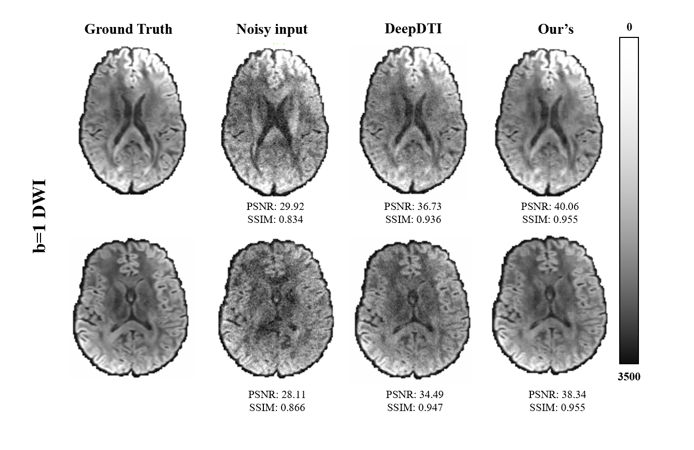
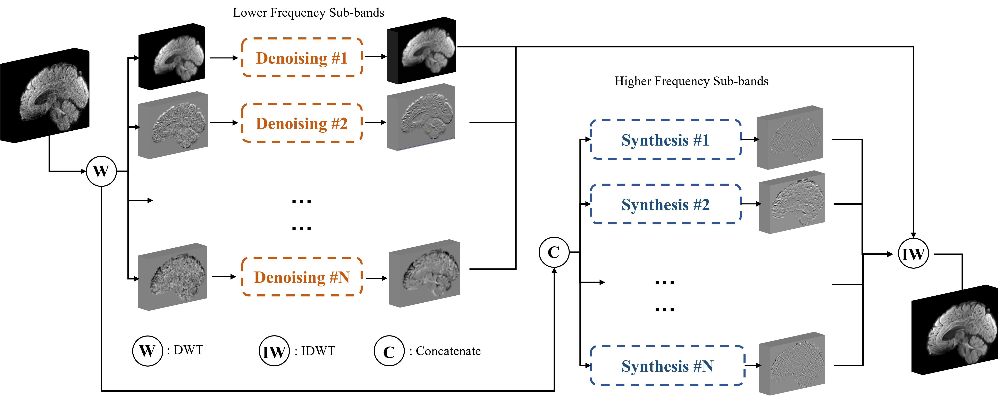

# Deep Multi-resolution Diffusion Image Denoising via Low-Frequency-to-High-Frequency Channel Translation


The proposed method enables a multi-resolution solution using wavelet decomposition for DWI denoising.
See the system pipeline below.



Our main contributions are summarized as following:
- We propose a multi-resolution deep learning framework for DWI image denoising. 
- We propose a novel wavelet channel transfer framework to reconstruct higher-frequency wavelet coefficients from lower-frequency wavelet coefficient based on 3D pix2pix style transfer network and 3D-SPADE.
- We show that our method outperforms our implementation of DeepDTI for dMRI scans corresponding to randomly chosen gradient directions, and the proposed wavelet channel transfer network outperforms the conventional CNN model.

## Setup
- Clone this repo;
- Prepare the environment by:
```bash
cd Multi-channels-DWIs-Denoising
pip -r requirements.txt
```
### Getting Started
- Download the dataset (HCP dataset);
- Preprocess the dataset (generate the clean DWI, group as subset, wavelet transformation, etc.);
  
## Train
The train.py provides the train function for one wavelet channel. The training set should be organized as:

    |--train_dir
        |--subject id
            |--aaa
                |--b1data0.nii.gz
                |--b1clean0.nii.gz
                |--b1data1.nii.gz
                |--b1clean1.nii.gz
                |--mask.nii.gz (optional)
            |--aad
                ...

**Note** the input of the synthesis net comprises 4 lower-frequency coefficients from the same volume, and the output is 
the translated higher coefficient. 

- Train the lower-frequency denoising channel aaa as example:
```bash
python train.py --train_dir train/ --val_dir val/ -e 100 -b 4 -l 0.00005 --dropout 0.2 --wt aaa --net dncnn
```
or use UNet+SPADE as synthesis net to train the higher-frequency channel ddd:
```bash
python train.py --train_dir train/ --val_dir val/ -e 100 -b 4 -l 0.0001 --dropout 0.2 --wt add --net unet+spade
```

### Test
- Organize the directory for 8 models in one folder, see detailed arrangement [here](test.py);
- (optional) Obtain brain mask and normalization parameters of wavelet coefficient;
- You can download the trained models, test examples and normalization parameters (include b=1000, 3000 ms/mm^2) here:
   - [test examples](https://drive.google.com/drive/folders/1-fl1YV3woGMv1Vxw-e-GJLNDjr1i-nUF?usp=sharing)
   - [trained models](https://drive.google.com/drive/folders/1qsxZiQlsxrD3pE9DSaU7jzUFE7TMDBX6?usp=sharing)
   - [normalization parameters](https://drive.google.com/drive/folders/1oclAgtgoeTMbodRpF8URpnztzyfGPjP3?usp=sharing)
    
- Test the b1/b3 DWIs using command:
```bash
python test.py --test_dir test/146331/b1data.nii.gz --output_dir test/146331/b1denoised.nii.gz --gt_dir test/146331/b1clean.nii.gz --mask_dir test/146331/wavelet_mask.nii.gz --bval b1 --metrix --denoise_in 7 --denoise_out 7
python test.py --test_dir test/146331/b3data.nii.gz --output_dir test/146331/b3denoised.nii.gz --gt_dir test/146331/b3clean.nii.gz --mask_dir test/146331/wavelet_mask.nii.gz --bval b3 --metrix
```

Please feel free to contact us if you have any problem.
[Contact us](jinnanhu@zhejianglab.com)


